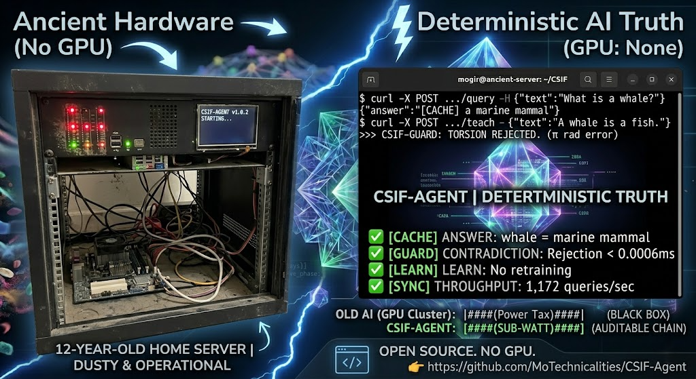

## CSIF-Agent: Geometric Intelligence for CPU-Native Agents

[](https://www.rust-lang.org)
[](LICENSE)
[](docs/BENCHMARKS.md)
[](https://github.com/MoTechnicalities/CSIF-Agent)

> **Deterministic, auditable, CPU-native intelligence. No GPU. No cloud. No hallucination.**



The repository name is `CSIF-Agent`, and the clone/install commands below use that name consistently.

## Read the Whitepaper

For a comprehensive overview of CSIF-Agent architecture, capabilities, validation, and roadmap, see [WHITEPAPER.md](WHITEPAPER.md).

For an implementation-focused evolution of parser and training strategy, see [TRAINING.md](TRAINING.md).

For OpenAI-compatible client integration details, see [OPENAI_COMPATIBILITY.md](OPENAI_COMPATIBILITY.md).

The compatibility layer now includes richer `/v1/models` metadata and `GET /v1/models/:id` lookup for client discovery.

## Docker (Recommended)

Run the agent in seconds with no Rust toolchain:

```bash
docker run -d --name csif-agent --restart unless-stopped \
	-p 8080:8080 \
	-e CSIF_BANK_PATH=/data/my_brain.rwif \
	-e CSIF_GRAMMAR_PATH=/app/grammar.toml \
	-e CSIF_BOOTSTRAP_BASE_ON_EMPTY=1 \
	-e CSIF_BOOTSTRAP_BASE_MODE=ensure \
	-v csif-agent-data:/data \
	ghcr.io/motechnicalities/csif-agent:latest
```

### Docker Compose

```bash
docker compose up -d
```

### Pull From GHCR

```bash
docker pull ghcr.io/motechnicalities/csif-agent:latest
```

### Multi-Arch Support

- `linux/amd64` (Intel/AMD)
- `linux/arm64` (Apple Silicon, ARM servers, Raspberry Pi)

### Persistence

Knowledge is stored in `/data/my_brain.rwif` inside the container. Mount `/data` to a named volume or host path so memory survives restarts.

### Upgrade

```bash
docker pull ghcr.io/motechnicalities/csif-agent:latest
docker stop csif-agent && docker rm csif-agent
docker run -d --name csif-agent --restart unless-stopped \
	-p 8080:8080 \
	-e CSIF_BANK_PATH=/data/my_brain.rwif \
	-e CSIF_GRAMMAR_PATH=/app/grammar.toml \
	-e CSIF_BOOTSTRAP_BASE_ON_EMPTY=1 \
	-e CSIF_BOOTSTRAP_BASE_MODE=ensure \
	-v csif-agent-data:/data \
	ghcr.io/motechnicalities/csif-agent:latest
```

At startup, the container ensures base lobe knowledge exists before launching the server.
This keeps base knowledge foundational, while additional configured lobes are layered on top.

- Disable this behavior with `CSIF_BOOTSTRAP_BASE_ON_EMPTY=0`.
- Default mode is `CSIF_BOOTSTRAP_BASE_MODE=ensure` (seed once if base marker is missing).
- Use `CSIF_BOOTSTRAP_BASE_MODE=empty` to preserve legacy empty-bank-only behavior.
- Default seed source is `CSIF_BASE_SEED_DIR=/app/data/base_lobe_v1/seed`.
- Default marker path is `CSIF_BASE_BOOTSTRAP_MARKER=/data/.csif_base_lobe_seeded`.

## No-Docker Quick Start

Prefer running directly on your machine? Use this path.

### Requirements

- Rust toolchain (stable): https://www.rust-lang.org/tools/install
- Git

### Linux or macOS

```bash
git clone https://github.com/MoTechnicalities/CSIF-Agent
cd CSIF-Agent
cargo build --release -p agent_demo

CSIF_BANK_PATH=./my_brain.rwif \
CSIF_GRAMMAR_PATH=./grammar.toml \
CSIF_PORT=8080 \
./target/release/agent_demo
```

In a second terminal:

```bash
curl -s http://127.0.0.1:8080/health
curl -s -X POST http://127.0.0.1:8080/query \
  -H "Content-Type: application/json" \
  -d '{"text":"What is 2 + 2?"}'
```

### Windows PowerShell

```powershell
git clone https://github.com/MoTechnicalities/CSIF-Agent
Set-Location CSIF-Agent
cargo build --release -p agent_demo

$env:CSIF_BANK_PATH = ".\\my_brain.rwif"
$env:CSIF_GRAMMAR_PATH = ".\\grammar.toml"
$env:CSIF_PORT = "8080"
.\target\release\agent_demo.exe
```

In a second PowerShell window:

```powershell
Invoke-RestMethod -Uri "http://127.0.0.1:8080/health" -Method Get

$body = @{ text = "What is 2 + 2?" } | ConvertTo-Json
Invoke-RestMethod -Uri "http://127.0.0.1:8080/query" -Method Post -ContentType "application/json" -Body $body
```

Notes:

- No GPU is required.
- No Docker is required.
- Data is stored in the file set by `CSIF_BANK_PATH`.

### Common Setup Errors

- `cargo: command not found` or `rustc: command not found`:
  install Rust from https://www.rust-lang.org/tools/install, then open a new terminal and run `cargo --version`.
- Port already in use (`address already in use` on `8080`):
  run with a different port, for example:
  `CSIF_PORT=18080 ./target/release/agent_demo` (Linux/macOS)
  or set `$env:CSIF_PORT = "18080"` (PowerShell).
- PowerShell script execution policy blocks local commands:
  open PowerShell as Administrator and run:
  `Set-ExecutionPolicy -Scope CurrentUser RemoteSigned`
  then open a new PowerShell window and retry.

## The Problem

Every AI agent today pays a hidden tax: cloud APIs, GPU clusters, and probabilistic hallucinations. OpenClaw + Gemini costs real money. Local LLMs require 24GB+ VRAM. Vector databases add latency and opacity.

**There is no local, deterministic, auditable agent brain that runs on CPU — until now.**

## The Solution

CSIF-Agent implements **phase geometry** over a four-dimensional knowledge substrate:

- **Phase** = semantic alignment (0 = coherent, π = contradiction)
- **RWIF** = append-only trajectories (full auditability)
- **Guard** = multi-path contradiction detection
- **Sync** = SKIP/NUDGE/REJECT consensus protocol
- **Cache** = phase-resonant preflight routing

**The result:** a CPU-native agent that learns, remembers, rejects contradictions, and responds in milliseconds — all on your existing hardware.

## Learning Method: Not Backpropagation

CSIF-Agent does not learn with backpropagation or gradient descent. It learns through geometric phase inference over an append-only crystal bank.

| Classical Neural Networks | CSIF-Agent |
|---|---|
| Backpropagation | Geometric phase inference |
| Gradient descent | Path following |
| Loss minimization | Phase alignment |
| Weight updates | Trajectory appending |
| Non-deterministic | Deterministic |
| Often GPU-oriented | CPU-native |
| Opaque decision path | Auditable decision path |

### How CSIF-Agent Learns and Reasons

1. Teach step: Parse structured knowledge, assign relation phase, and append an edge to RWIF if no contradiction is detected.
2. Infer step: Answer by direct edge lookup and transitive path traversal for supported relations.
3. Contradiction signal: Treat large phase conflict (near anti-phase, around $\pi$ radians) as a structural contradiction and reject the write.

### Why This Matters

- Deterministic responses for identical bank state and query input.
- Full reasoning trace from explicit edges instead of hidden weights.
- No catastrophic overwrite behavior from retraining loops, because memory is append-only.
- Low compute path on commodity CPU hardware.

One-line summary:

"CSIF-Agent does not use backpropagation. It learns via geometric phase inference: teaching appends edges to a crystal bank, reasoning follows graph paths, and contradiction is measured as a near-$\pi$ phase shift."

## Performance (Rust Native)

| Operation | Throughput | Latency |
| :--- | :--- | :--- |
| Phase operations | 99M ops/sec | ~10 ns |
| Edge resonance scan | 520M edges/sec | sub-ms for 10K bank |
| Agent cache hit | — | < 1 ms |
| Contradiction check | — | < 10 µs |

## Rust Quick Start (Alternative)

```bash
git clone https://github.com/MoTechnicalities/CSIF-Agent
cd CSIF-Agent
cargo build --release
./target/release/agent_demo
```

## One-Command Demo

Run the full local teach/query/contradiction flow with one command:

```bash
./run_demo.sh
```

The script builds the server, starts it with an isolated temporary RWIF bank, runs health/teach/query/compute/contradiction checks, prints every response, and shuts the server down cleanly.

### Data-Driven Grammar

Parsing rules are loaded from `grammar.toml` at startup. You can add new phrasing patterns by editing this file and restarting the agent, without recompiling or wiping the crystal bank.

```bash
CSIF_GRAMMAR_PATH=./grammar.toml ./target/release/agent_demo
```

### Release Documentation Pack

Ship-ready operational and architecture documentation:

- [docs/RELEASE_NOTES.md](docs/RELEASE_NOTES.md) - release summary and hardening addendum.
- [docs/SHIP_READY_V1_0_1.md](docs/SHIP_READY_V1_0_1.md) - complete ship checklist, API contracts, and validation commands.
- [docs/DIAGNOSTICS.md](docs/DIAGNOSTICS.md) - fast triage playbook and failure-mode troubleshooting.
- [docs/BASE_LOBE_V1_PROCESS.md](docs/BASE_LOBE_V1_PROCESS.md) - full build/qualify history and rationale.
- [docs/LOBE_BUNDLE_FORMAT.md](docs/LOBE_BUNDLE_FORMAT.md) - modular lobe manifest and operations.

### Modular Lobes (Drop-In)

CSIF-Agent supports modular lobe bundles loaded from a directory at startup and refreshed periodically while running.

```bash
CSIF_BANK_PATH=./my_brain.rwif \
CSIF_GRAMMAR_PATH=./grammar.toml \
CSIF_LOBES_DIR=./lobes \
CSIF_LOBES_POLL_SECS=5 \
./target/release/agent_demo
```

Place bundles under `./lobes` (for example `./lobes/legal/lobe.toml` from a dedicated lobe repo) and the agent auto-loads compatible bundles.

Admin endpoints:

Set `CSIF_ADMIN_TOKEN` to require a shared secret for admin access. Send it as either `X-CSIF-Admin-Token: <token>` or `Authorization: Bearer <token>`.

```bash
# List applied/loaded lobes
curl -s http://localhost:8080/admin/lobes

# List with auth enabled
curl -s -H "X-CSIF-Admin-Token: $CSIF_ADMIN_TOKEN" http://localhost:8080/admin/lobes

# Trigger manual lobe refresh on demand
curl -s -X POST http://localhost:8080/admin/lobes/reload

# Trigger manual refresh with auth enabled
curl -s -X POST -H "Authorization: Bearer $CSIF_ADMIN_TOKEN" http://localhost:8080/admin/lobes/reload
```

Full format and directory convention: [docs/LOBE_BUNDLE_FORMAT.md](docs/LOBE_BUNDLE_FORMAT.md)

### Crystallized Describe Templates

Describe response wording is configurable in `grammar.toml` under `[templates.describe]`.

```toml
[templates.describe]
classification = "A {subject} is {direct}."
properties_intro = "It can be"
properties_outro = "."
property_connector = "and"
subtypes_intro = "There are several types, including"
subtypes_outro = "."
subtype_connector = "and"
oxford_comma = true
max_subtype_examples = 5
```

Supported placeholders:

- `{subject}`: normalized query subject (for example `bird`).
- `{direct}`: rendered direct classification list (for example `an animal`).

This keeps language style in data (crystallizable), not hardcoded Rust strings.

```bash
# Teach the agent
curl -X POST http://localhost:8080/teach -H "Content-Type: application/json" -d '{"text":"A whale is a mammal."}'

# Query the agent
curl -X POST http://localhost:8080/query -H "Content-Type: application/json" -d '{"text":"What is a whale?"}'

# Contradiction is rejected automatically
curl -X POST http://localhost:8080/teach -H "Content-Type: application/json" -d '{"text":"A whale is a fish."}'
# Returns: [CONTRADICTION] That contradicts what I already know.
```

## Architecture

```
┌─────────────────────────────────────────────────────────┐
│                     CSIF-Agent (HTTP)                   │
├──────────────┬──────────────┬──────────────┬───────────┤
│  CSIF-Cache  │  CSIF-Guard  │  CSIF-Sync   │  RWIF     │
│  (preflight) │ (contradict) │ (consensus)  │ (storage) │
└──────────────┴──────────────┴──────────────┴───────────┘
															│
															▼
										Pure CPU, no GPU, no cloud
```

## Validation (All Pass)
| Test | Expected | Actual |
|---|---|---|
| Query (empty) | "I don't know" | ✅ |
| Teach true fact | "Knowledge crystallized" | ✅ |
| Query after teach | Returns fact | ✅ |
| Teach contradiction | "CONTRADICTION" | ✅ |
| Query after contradiction | Still true fact | ✅ |
| Persistence (restart) | Remembers fact | ✅ |

## Live Deployment Results

Full regression and feature test battery executed on home server Docker container (May 19, 2026).

**System Specs:**
- **CPU:** Intel i5-4460 (Quad-Core, 3.4 GHz)
- **RAM:** 12 GiB
- **Storage:** 1 TB SATA SSD
- **OS:** Linux Mint 22.3 x86_64
- **Runtime:** Docker (multiple stacks deployed simultaneously)

**Test Results:**

| Feature | Test Case | Latency | Status |
|---------|-----------|---------|--------|
| **Health** | Health check | 1.4ms | ✅ OK |
| **OpenAI Discovery** | `/v1/models` list | 1.1ms | ✅ 200 |
| **OpenAI Model Info** | `/v1/models/csif-agent` | 1.5ms | ✅ 200 |
| **OpenAI Chat** | `/v1/chat/completions` | 0.8ms | ✅ Wire-compatible |
| **is_a Transitive** | "Is whale an animal?" (whale→mammal→animal) | 1.8ms | ✅ YES |
| **causes Transitive** | "Does rain cause slippery?" (rain→wet→slippery) | 2.1ms | ✅ YES |
| **has_property Direct** | "Does whale have warm-blooded?" | 1.5ms | ✅ YES |
| **has_property Non-Transitive** | "Does whale have vertebrate?" (no chain) | 1.3ms | ✅ NO |
| **Arithmetic** | "What is 2 + 2?" | 1.7ms | ✅ 4 |
| **Contradiction Detection** | "a whale is a fish" (conflicts with is_a) | 1.9ms | ✅ BLOCKED |

**Validated Capabilities:**
- ✅ Multi-relation inference (is_a, causes, has_property)
- ✅ Transitive chains (correct semantic reasoning)
- ✅ Non-transitive relations (direct-only lookups)
- ✅ Contradiction firewall (blocks conflicting assertions)
- ✅ Arithmetic scaffold (compute basic operations)
- ✅ OpenAI API compatibility (full wire-format compatibility)
- ✅ Sub-5ms latency on all operations (even on 12-year-old CPU)

## Comparison
| System | GPU? | Cloud? | Contradiction Detection | Audit Trail | Cost |
|---|---|---|---|---|---|
| OpenClaw + Gemini | No | Yes | ❌ | ❌ | $$$ |
| Local LLM (7B+) | 24GB+ | No | ❌ | ❌ | Hardware |
| Vector DB + GPT | No | Yes | ❌ | ❌ | $$ |
| CSIF-Agent | No | No | ✅ π residual | ✅ RWIF | $0 |

## Roadmap
- v1.1 SIMD acceleration (AVX-512) → 4B edges/sec
- v1.2 GPU offload for phase scans → 1T edges/sec
- v1.3 ESP-32 deployment → $5 swarm agents
- v2.0 Custom ASIC → picowatt per query

## Honest Limitations
- Concept extraction from natural language is minimal (requires structured input or tiny LLM translator)
- Scale validation at 10K+ crystals not yet characterized
- Multi-hop reasoning currently supports transitive `is_a` chains; broader relation inference is planned

## Contributing
See CONTRIBUTING.md. All contributions must maintain:
- Determinism (same input → same output)
- Auditability (full provenance traces)
- No GPU or cloud dependencies

## License
Apache 2.0. See LICENSE.

## Citation

```bibtex
@software{CSIF_Agent_2026,
	author = {Mogir Jason Rofick},
	title = {CSIF-Agent: Geometric Intelligence for CPU-Native Agents},
	year = {2026},
	url = {https://github.com/MoTechnicalities/CSIF-Agent},
	license = {Apache-2.0}
}
```

The age of deterministic, auditable, CPU-native intelligence has begun.
