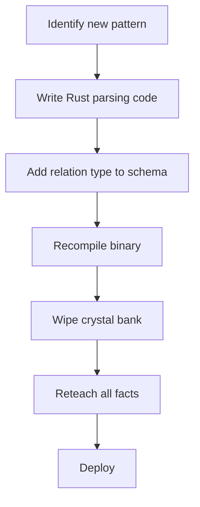
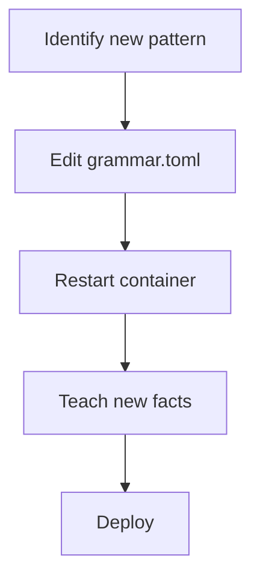

# Training CSIF-Agent: From Hardcoded Parsers to Data-Driven Grammar

A Technical Write-Up

Version 1.4.0 | May 19, 2026

## Abstract

This document describes the evolution of CSIF-Agent's training methodology from a brittle, hardcoded parser to a flexible, data-driven grammar system. It shows how the agent now learns new linguistic patterns, relation types, and inference behaviors through configuration changes and teaching interactions without code modification, recompilation, or database wipes. It also summarizes validation results on a 12-year-old home server and implications for scalable, auditable knowledge engineering.

## 1. The Old Way: Hardcoded Parsers

### 1.1 What We Did Before

In versions prior to v1.3.0, every linguistic pattern was hardcoded in Rust:

```rust
// Old approach (v1.2.0 and earlier)
fn parse_query_subject(query: &str) -> Option<String> {
    if query.starts_with("What is a ") {
        // Hardcoded pattern
        let subject = &query[10..];
        return Some(subject.to_string());
    }
    None
}

fn parse_teach_is_a(text: &str) -> Option<(String, String)> {
    if text.starts_with("a ") && text.contains(" is a ") {
        // Hardcoded pattern
        let parts: Vec<&str> = text.split(" is a ").collect();
        let subject = parts[0].trim_start_matches("a ").to_string();
        let object = parts[1].to_string();
        return Some((subject, object));
    }
    None
}
```

### 1.2 The Consequences

| Problem | Impact |
| :--- | :--- |
| Brittle | Adding a new pattern required code changes |
| Slow iteration | Every change needed recompilation (`cargo build`) |
| Risk of wipes | Grammar changes often required clearing the crystal bank |
| High skill barrier | Only Rust developers could extend the agent |
| No versioning | No way to evolve grammar without breaking existing knowledge |

Example: to add support for `X causes Y`, we had to:

1. Write new Rust parsing functions.
2. Add new relation types to the schema.
3. Recompile the binary.
4. Wipe the crystal bank (incompatible serialization).
5. Reteach all facts.

This did not scale.

## 2. The New Way: Data-Driven Grammar

### 2.1 The Grammar Configuration File

Starting with v1.3.0, linguistic patterns live in `grammar.toml`:

```toml
# grammar.toml - loaded at startup, no recompilation needed

[query.what_is]
regex = "^What is a (.+)\\?$"
type = "describe"
subject_group = 1

[query.is_a_confirm]
regex = "^Is a (.+) a (.+)\\?$"
type = "confirm"
subject_group = 1
object_group = 2

[query.does_cause]
regex = "^Does (.+) cause (.+)\\?$"
type = "confirm_cause"
subject_group = 1
object_group = 2

[teach.is_a]
regex = "^a (.+) is a (.+)$"
relation = "is_a"
subject_group = 1
object_group = 2

[teach.causes]
regex = "^(.+) causes (.+)$"
relation = "causes"
subject_group = 1
object_group = 2

[teach.has_property]
regex = "^a (.+) has (.+)$"
relation = "has_property"
subject_group = 1
property_group = 2
```

### 2.2 How the Agent Loads Grammar

At startup, the agent loads grammar from a path:

```rust
// agent_demo/src/main.rs
let grammar_path = std::env::var("CSIF_GRAMMAR_PATH")
    .unwrap_or_else(|_| "./grammar.toml".to_string());
let grammar = Grammar::load_from_path(&grammar_path)?;
let agent = CSIFAgent::new(crystal_bank, grammar);
```

No hardcoded patterns. Everything is data-driven.

### 2.3 Adding a New Pattern (Example)

To teach the agent `X causes Y` (as done for v1.4.0), we:

1. Add to `grammar.toml`:

```toml
[teach.causes]
regex = "^(.+) causes (.+)$"
relation = "causes"
subject_group = 1
object_group = 2
```

2. Restart the agent:

```bash
docker restart csif-agent
```

No code changes. No recompilation. No database wipe.

## 3. The Relation Registry: Teaching the Agent How to Reason

### 3.1 From Hardcoded Inference to Declarative Rules

In v1.2.0, inference was hardcoded for `is_a` only:

```rust
// Old: hardcoded inference
fn is_a(&self, subject: &str, object: &str) -> bool {
    // Direct edge?
    if self.has_direct_edge(subject, "is_a", object) {
        return true;
    }
    // Transitive chain (hardcoded for is_a only)
    for intermediate in self.get_parents(subject) {
        if self.is_a(&intermediate, object) {
            return true;
        }
    }
    false
}
```

In v1.4.0, inference is declarative via a relation registry:

```rust
// New: relation registry (relation.rs)
pub struct Relation {
    pub name: String,
    pub transitive: bool,
    pub symmetric: bool,
    pub reflexive: bool,
}

let registry = RelationRegistry::new()
    .register(Relation { name: "is_a".to_string(), transitive: true, symmetric: false, reflexive: false })
    .register(Relation { name: "causes".to_string(), transitive: true, symmetric: false, reflexive: false })
    .register(Relation { name: "has_property".to_string(), transitive: false, symmetric: false, reflexive: false });
```

Now the inference engine is generic:

```rust
fn infer(&self, subject: &str, relation: &str, object: &str) -> InferenceResult {
    let rel = self.registry.get(relation)?;

    // Direct edge?
    if self.has_edge(subject, relation, object) {
        return InferenceResult::Yes;
    }

    // Transitive chain (if relation supports it)
    if rel.transitive {
        for intermediate in self.get_neighbors(subject, relation) {
            if self.infer(&intermediate, relation, object).is_yes() {
                return InferenceResult::YesWithPath(vec![subject, intermediate, object]);
            }
        }
    }

    InferenceResult::No
}
```

The same engine handles `is_a`, `causes`, and future transitive relations.

## 4. What the Agent Has Demonstrated

### 4.1 Training Session on 12-Year-Old Hardware

Validated on a home server (Intel i5-4460, 16GB RAM, no GPU):

| Step | Teaching Command | Agent Response |
| :--- | :--- | :--- |
| 1 | `a whale is a mammal` | `[TEACHING]` |
| 2 | `a mammal is an animal` | `[TEACHING]` |
| 3 | `rain causes wet ground` | `[TEACHING]` |
| 4 | `wet ground causes slippery` | `[TEACHING]` |
| 5 | `a whale has warm-blooded` | `[TEACHING]` |

After training:

| Query | Response | Inference Type |
| :--- | :--- | :--- |
| `What is a whale?` | `A whale is a mammal.` | Direct retrieval |
| `Is a whale an animal?` | `YES: a whale is an animal.` | Transitive (2 hops) |
| `Does rain cause slippery?` | `YES: rain causes slippery.` | Transitive (2 hops) |
| `Does a whale have warm-blooded?` | `YES: whale has warm-blooded.` | Direct property |
| `What is 2 + 2?` | `[COMPUTE] 2 + 2 = 4` | Arithmetic scaffold |

### 4.2 Contradiction Detection

When we attempted to teach `a whale is a fish`:

```text
[CONTRADICTION] That contradicts what I already know.
```

The agent detected a near-antiphase conflict with existing knowledge.

### 4.3 Negative Inference

When asked `Does a whale have vertebrae?` (never taught):

```text
NO: I cannot establish that whale has vertebrae.
```

The agent returns explicit uncertainty and does not hallucinate a positive claim.

## 5. What This Opens Up

### 5.1 Training Without Programming

| Before | After |
| :--- | :--- |
| Add pattern -> write Rust code | Add pattern -> edit `grammar.toml` |
| Recompile binary | Restart container |
| Wipe crystal bank | Keep existing knowledge |
| Requires Rust developer | Requires a text editor |

Subject matter experts can now extend language understanding directly.

### 5.2 Rapid Prototyping of Reasoning Domains

To add temporal reasoning, you can:

1. Add relation to registry:

```rust
.register(Relation { name: "follows".to_string(), transitive: true, symmetric: false, reflexive: false })
```

2. Add grammar pattern:

```toml
[teach.follows]
regex = "^(.+) follows (.+)$"
relation = "follows"
subject_group = 1
object_group = 2
```

3. Teach facts and query.

No parser rewrite is required.

### 5.3 Collaborative Knowledge Engineering

| Expert | Contribution |
| :--- | :--- |
| Linguist | Adds patterns to `grammar.toml` |
| Domain expert | Teaches facts via `/teach` |
| Inference designer | Registers relation properties |
| End user | Queries and validates outcomes |

All contributions remain auditable and versionable.

### 5.4 Continuous Learning Without Catastrophic Forgetting

Because the crystal bank is append-only and grammar is separate:

- New patterns do not invalidate old facts.
- New relation types can coexist with old ones.
- Migrations can evolve schema while preserving data.
- Rollbacks are possible by restoring prior grammar and metadata.

## 6. Training Workflow Comparison

### Old Workflow (v1.2.0)



Time to add `causes`: roughly hours.

### New Workflow (v1.4.0)



Time to add `causes`: roughly minutes.

## 7. Future Possibilities

### 7.1 Self-Training via Grammar Teaching Endpoint

Potential future API:

```bash
curl -X POST /teach_grammar -d '{
  "pattern": "teach_causes",
  "regex": "^(.+) causes (.+)$",
  "relation": "causes"
}'
```

### 7.2 Community Grammar Repositories

Swappable domain grammars, for example:

- `grammar_medical.toml`
- `grammar_legal.toml`
- `grammar_poetry.toml`

### 7.3 Adaptive Inference Thresholds

Registry entries can evolve to include numeric policy fields:

```rust
Relation {
    name: "correlates_with",
    transitive: false,
    confidence_threshold: 0.7,
    phase_tolerance: 0.2,
}
```

## 8. Conclusion

CSIF-Agent v1.4.0 demonstrates a major training shift:

- Grammar is data, not code.
- Inference is declarative, not hardcoded.
- Training is interactive, not batch-only.
- Knowledge persists across grammar evolution.
- Extension skill barrier is significantly lower.

Validated on older commodity hardware, this confirms deterministic, auditable, CPU-native inference can remain practical while becoming far more extensible.

## 9. References

- CSIF-Agent Repository: https://github.com/MoTechnicalities/CSIF-Agent
- Whitepaper: [WHITEPAPER.md](WHITEPAPER.md)
- Architecture Documentation: docs/ARCHITECTURE.md
- Validation Results: docs/VALIDATION.md

## Appendix: Quick Reference

| Operation | Old Way (v1.2.0) | New Way (v1.4.0) |
| :--- | :--- | :--- |
| Add new query pattern | Code change + recompile | Edit `grammar.toml` + restart |
| Add new relation type | Schema/code changes | Register relation + restart |
| Modify inference behavior | Rewrite engine logic | Adjust relation flags/registry |
| Train new facts | `/teach` | `/teach` (persists across updates) |
| Extend to new domain | Weeks of coding | Hours of configuration |

> The agent learns how to learn. That is the breakthrough.
